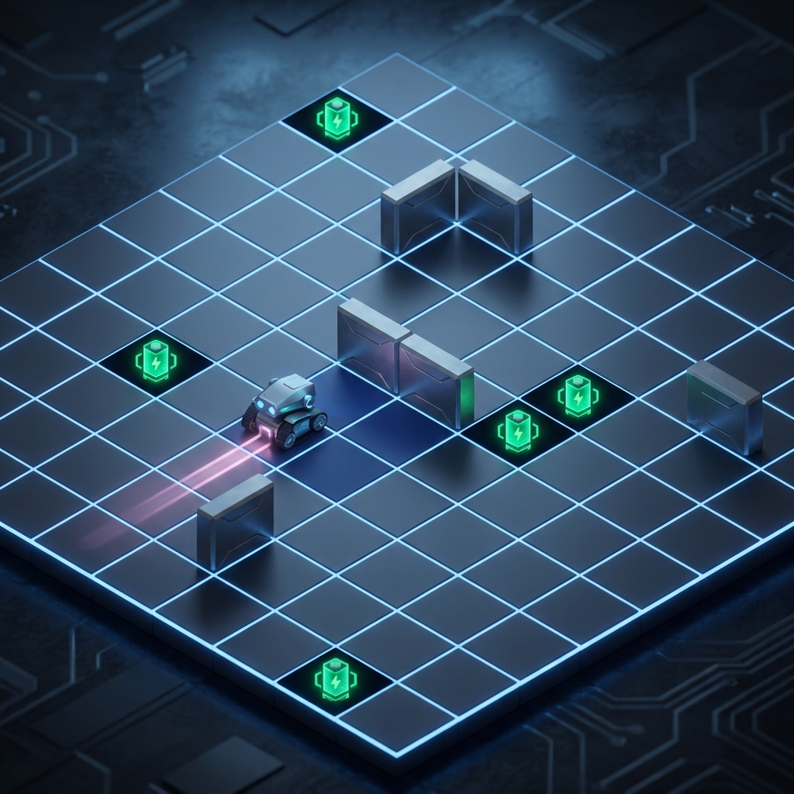

# General Learner 4 - Cognitive Simulation



An implementation of the **Universal Learner** concept based on the theories of Fritz et al. (1989). This simulation explores autonomous learning in a restricted environment where a robot must manage internal needs (energy/tiredness) while learning spatial-temporal patterns through reinforcement.

## Core Features

- **Autonomous Sequential Learning**: The robot associates perceptions (vision/touch) with actions and rewards.
- **Episodic Memory**: Experiences are stored chronologically in a SQLite database.
- **Dream/Sleep Consolidation**: During sleep cycles, the system generalizes experiences, transforming chronological memory into abstract and composite rules.
- **Bimodal Operation**:
  - **Autonomous Mode**: The robot explores and acts based on its learned knowledge.
  - **Command Mode**: Allows manual control and direct textual reinforcement.
- **Guide Mode**: A vicarious learning feature where users "draw" a path for the robot to teach it successful navigation strategies.

## Usage & Experimentation Guide

### 1. Training Phase (Manual Teaching)
The fastest way to teach the robot is using the **GUIDE MODE**:
1. Click **GUIDE MODE** (it will turn orange).
2. Click on the grid cells adjacent to the robot to lead it toward a battery (green icon).
3. Observe the **Light Pink** path indicating the taught trajectory.
4. Each guided step grants the robot `+10` reinforcement, stored in its memory.

### 2. Observation Phase (Autonomous)
Once the robot has some memory:
1. Switch to **AUTONOMOUS** mode.
2. Watch as the robot tries to replicate successful patterns or explore new ones.
3. If it hits a wall, it receives `-10` points, teaching it to avoid that specific perception-action pair.

### 3. The Dream Cycle (Generalization)
The robot will automatically "sleep" when its tiredness reaches the limit (50 steps). You can also trigger it manually with **DREAM / SLEEP**:
- Look at the console to see how many new rules were generated.
- In the background, the system looks at sequences: if $Step A \to Step B \to Reward$, it creates a **Composite Rule** linking $Step A$ to the eventual success.

### 4. Data Analysis
Click **EXPORT DATA** to generate `db_export.txt`. Open this file to see:
- **Concrete Rules**: Simple associations.
- **Composite Rules**: Sequential knowledge derived during the dream phase.
- **Weights**: Higher weights represent more reliable knowledge.

## Technical Stack

- **Languaje**: Python 3.11.2
- **Engine**: PyGame
- **Database**: SQLite3 (Recursive memory storage)
- **Environment**: 10x10 Grid with procedurally placed walls and batteries.

## Installation

1. Clone the repository:
   ```bash
   git clone https://github.com/marcobaturan/General_Learner_4.git
   ```
2. Run with Python:
   ```bash
   python main.py
   ```

---
*Created as part of the Intelligent Systems Research series.*
