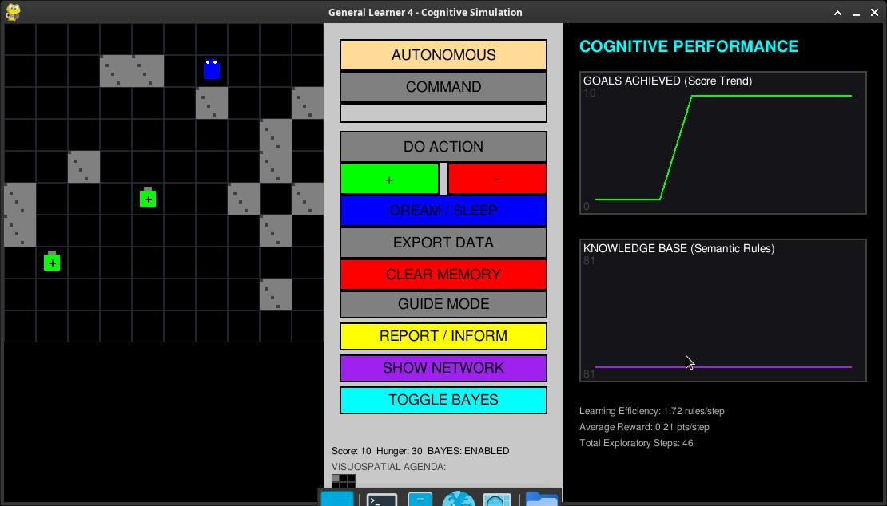

# General Learner 5: A Cognitive Autonomous Architecture


General Learner 5 is an advanced autonomous agent inspired by the **Universal Learner model** (Fritz et al., 1989) and contemporary hippocampal research. This project demonstrates emergent situational mapping, probabilistic decision-making, and biological homeostasis within a real-time 2D simulation.

> 📖 **Full Research Documentation**: For a detailed academic overview citing the cybernetic lineage (W. Grey Walter, J. Andrade, W. Fritz) and cognitive formulas, please read our [White Paper](WHITE_PAPER.md).

---

## 📽️ System Demonstration
### Watch General Learner 4 in Action
[](GL5-2026-04-08_17_38_24.mp4)

---

## 🔭 2.5D Raycasting POV (Robot Vision)

The GL4 now features a **Wolfenstein-style 2.5D Rendering Engine**. This allows the user to see exactly what the robot "sees" in real-time, providing an immersive perspective on its spatial navigation.

- **Directional Shading**: Walls are rendered with differential brightness (N/S vs E/W) to create realistic contours and depth.
- **Visual Grounding**: The POV system helps the user understand why the robot identifies specific 3x3 patterns as stable landmarks.


*Figure 1: The 2.5D Raycasting view showing the robot's egocentric perspective.*

---

## 🔬 Cognitive Architecture (The 4 Pillars)

The GL4 architecture separates raw perception from logical representation, allowing for high-level "Mental Imagery" and adaptive planning.

### 1. Situational World Map (Hippocampal Locale Mapping)
Inspired by **O'Keefe & Nadel**, the agent constructs a **Directed Conceptual Graph**:
- **Nodes**: Each unique 3x3 visual pattern ($S_n$) is treated as a stable "Landmark".
- **Edges**: The agent learns the transition $(S_1, A) \to S_2$.


*Figure 2: The Situational Network showing the robot's internal representation of the environment.*

### 2. Visuospatial Agenda (Mental Simulation)
The system maintains a **Visuospatial Sketchpad** (Working Memory):
- When a distal goal is detected, the agent performs a mental BFS (Breadth-First Search) through its Situational Map.
- It generates an **Agenda**: a sequence of future "Expected Landmarks."

### 3. Bayesian Thompson Sampling (Probabilistic Decision Engine)
To balance exploration and exploitation, GL4 utilizes **Bayesian Inference**:
- **Beta Distribution**: Each action is a probability curve.
- **Dynamic Sampling**: The robot "samples" its beliefs for every step, leading to more "curious" behavior when rules are weak and "decisive" behavior when rules are expert-level.

### 4. Biological Homeostasis & Forgetting
The system implements a biological maintenance cycle (Sleep/Dream):
- **Ebbinghaus Forgetting Curve**: Memories decay over time to prevent cognitive overload.
- **Differential Decay**: Crucial spatial landmarks enjoy a **Protected Status** (5x slower decay).

---

## 🗣️ Symbolic Command Grounding (Natural Language)

Unlike systems with hardcoded keywords, GL4 implements **Symbolic Grounding**:
- **Arbitrary Association**: The robot learns to associate any text string (e.g., "GIRA", "DERECHA", "MOVE") with physical actions through experience.
- **Command Priority**: Once a symbol is "grounded" (associated with a successful outcome), the robot prioritizes user commands over its own autonomous drives.


*Figure 3: The Symbolic Command and Homeostatic Sidebar.*

### 5. Cognitive Macro Learning & Command Decomposition
The GL4 now possesses the ability to **"chunk"** actions and decompose complex sentences:
- **Macro Induction**: During the `SLEEP` cycle, the agent scans its history for repetitive patterns under the same command string (e.g., "L-SHAPE") and creates a **Composite Rule**.
- **Recursive Decomposition**: The agent can now process multi-part commands like "Avanza y Gira". It splits the string by conjunctions (`,`, `y`) and executes the sub-parts sequentially using its `Active Plan` buffer.
- **Sequential Execution**: Loaded macros are stored in the user's `active_plan`, allowing the robot to execute long behavioral sequences from a single textual trigger.

---

## 🦮 Guided Mode (Vicarious Learning)

In **Guided Mode**, the user can "lead" the robot through a path. 
- **Forced Movement**: Clicks in this mode immediately move the robot, acting as "Forced Instruction."
- **Expert Absorption**: The robot performs **Vicarious Learning**, absorbing the user's expertise directly into its Situational Map.


*Figure 4: Guided Mode highlighting the robot's prediction of intended target cells.*

---

## 📊 Performance Inform / Report

The **Cognitive Dashboard** provides real-time telemetry on learning efficiency, rule consolidation, and objective achievement.


*Figure 5: The Performance Analytics panel displaying live learning trends.*

---

## 🛠️ Codebase Execution
Capturing the simulation and terminal state during a training run.


---

## 🚀 Installation & Usage
1. **Requirements**: Python 3.11+, PyGame, SQLite3.
2. **Run**:
   ```bash
   python main.py
   ```
3. **Tests**:
   ```bash
   python -m unittest discover tests
   ```

---
*Developed by Marco Baturan | Cybernetic Legacy: W. Grey Walter, W. Fritz, J. Andrade.*
