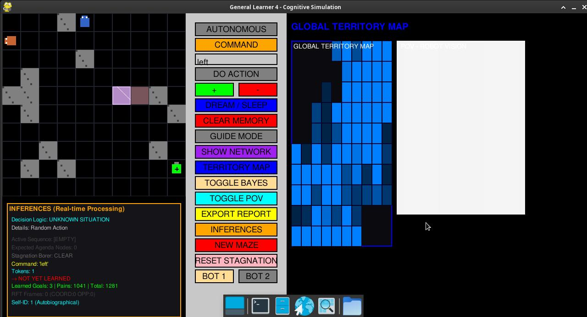
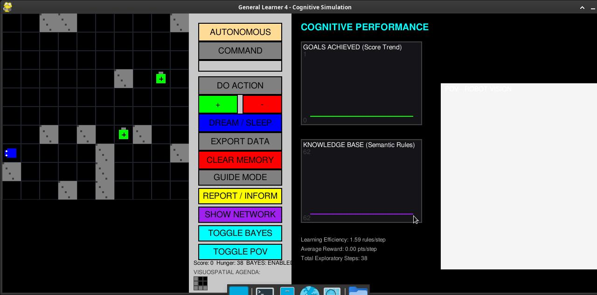

# General Learner 5.1 (GL5.1): Dual-Bot Social Interaction Architecture



General Learner 5.1 (GL5.1) extends GL4/GL5 with **two autonomous cognitive agents** sharing a 2D maze environment. This research platform explores emergent social behavior, mutual recognition, and physical interaction principles between artificial agents — drawing from Schelling's segregation models, Axelrod's cooperation evolution, and Brooks' subsumption architecture.

> 📖 **Full Research Documentation**: For a detailed academic overview citing the cybernetic lineage (W. Grey Walter, J. Andrade, W. Fritz) and cognitive formulas, please read our [White Paper](WHITE_PAPER.md).

---

## 📽️ System Demonstration
### Watch General Learner 5.1 Dual-Bot in Action
[](assets/GL5-2026-04-09_20.19.50.mp4)

---

## 🔬 Research Platform: Dual-Bot Social Interaction

GL5.1 implements a **Multi-Agent System (MAS)** where two independent cognitive agents co-inhabit a 2D maze. This enables quantitative study of emergent social behaviors predicted by foundational research:

| Theoretical Foundation | Researcher | Application |
|------------------------|------------|-------------|
| Segregation from local preferences | Thomas Schelling (1971) | Territory formation via collision avoidance |
| Evolution of cooperation | Robert Axelrod (1984) | Implicit cooperation patterns |
| Emergent flocking | Craig Reynolds (1987) | Boids-like separation behavior |
| Subsumption architecture | Rodney Brooks (1991) | Reflex-based social interaction |

### Key Implemented Features

- **Pauli Exclusion**: Bots block each other's movement (no shared tiles)
- **Pain on Impact**: Collision triggers -5 energy penalty to both agents
- **Mutual Recognition**: Each bot detects other via ID 99 in perception grid
- **Self vs Other Differentiation**: Mirror reflection = self; other bot = not-self
- **Psychosis Cure (Reset Button)**: Prevents TOC (Touch-of-Contract) when maze empty
- **Independent Memory**: Separate SQLite databases for each agent
- **Experimental CSV Logging**: Quantitative metrics for hypothesis testing

---

## 🔭 2.5D Raycasting POV (Robot Vision)

The GL5.1 POV renders each bot's egocentric perspective with dynamic coloring:
- **Self in mirror**: Bot sees itself in its own color (blue/orange)
- **Other bot**: Rendered in opposite color to viewer


*Figure 1: The 2.5D Raycasting view showing the robot's egocentric perspective.*

---

## 🖥️ Development Environment

### Hardware Platform
| Component | Specification |
|-----------|---------------|
| **CPU** | AMD Ryzen 7 4000 Series (Renoir) — 8 cores |
| **RAM** | 16 GB (shared with iGPU) — Budget: ~4 GB max |
| **Storage** | 476 GB NVMe SSD |
| **Display** | Integrated GPU (iGPU) — CPU-only rendering |
| **OS** | Debian 12 (Bookworm) Linux |

### Software Stack
| Layer | Technology |
|-------|------------|
| **Runtime** | Python 3.11.2 |
| **Graphics** | Pygame 2.1.2 (CPU rendering, 30 FPS cap) |
| **Database** | SQLite3 (in-memory, dual independent DBs) |
| **OS** | Debian 12 (Linux) |
| **Package Manager** | UV (recommended) / pip |

### Development Tools
| Tool | Purpose |
|------|---------|
| **OpenCode Big Pickle** | Interactive CLI development agent |
| **Claude Code** | AI development assistant |
| **Antigravity** | Architectural framework (AG_Structure) |
| **Git** | Version control |

---

## 🚀 Installation & Usage

### Quick Install (UV - Recommended)
```bash
# Install UV if not available
curl -LsSf https://astral.sh/uv/install.sh | sh

# Install dependencies
uv pip install -r requirements.txt

# Run
python3 main.py
```

### Alternative (pip)
```bash
pip install -r requirements.txt
python3 main.py
```

### Requirements File (requirements.txt)
```
pygame>=2.1.0
psutil>=5.9.0
```

### Controls
- **Arrow Keys**: Move robot manually
- **D**: Toggle autonomous mode
- **S**: Sleep/dream (consolidate memory)
- **M**: Mirror test (self-recognition)
- **SPACE**: Pause/Resume
- **ESC**: Quit
- **Click BOT 1 / BOT 2**: Switch display between agents

---

*Developed by Marco Baturan | Collaborators: Claude Code, Antigravity, OpenCode Big Pickle*
*Cybernetic Legacy: W. Grey Walter, W. Fritz, J. Andrade*
*Research Lineage: Schelling, Axelrod, Reynolds, von Neumann, Brooks*
