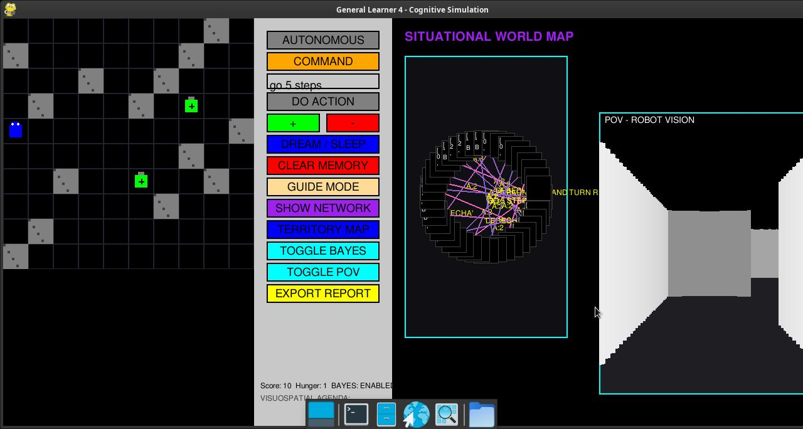
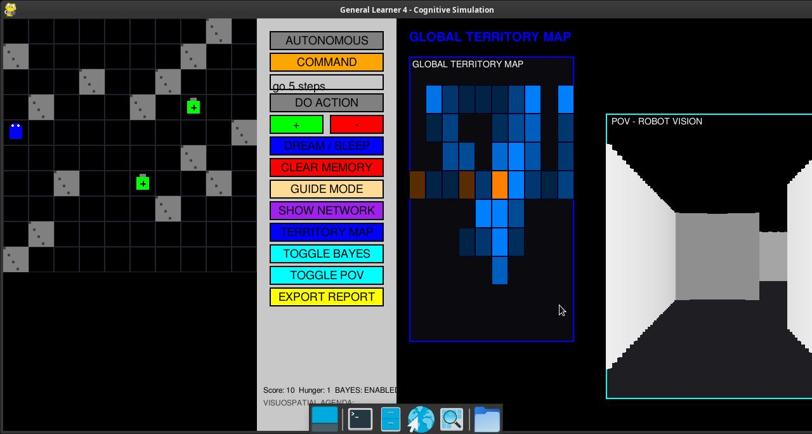

# Symbolic Cognitive Architecture: A Fuzzy Bayesian Approach to Autonomous Agents

**Authors**: Marco, W. Grey Walter (in memoriam), W. Fritz (in memoriam)

**Collaborators**: 
- Claude Code (AI Development Assistant)
- Antigravity (Architectural Framework)
- OpenCode Big Pickle (Interactive Development Agent)

## Abstract


This paper details the evolution and mechanics of the *General Learner 5.1 (GL5.1)*, an autonomous multi-agent intelligent system exploring the intersection of Fuzzy Logic, Bayesian Action Selection, Asymptotic Memory Decay, and emergent social interaction between two autonomous cognitive agents. Built upon the pioneering cybernetic frameworks of W. Grey Walter's tortoises and W. Fritz's General Learner series, GL5.1 demonstrates how two agents can iteratively construct functional understanding of their shared environment through symbolic grounding, reinforcement learning, and physical interaction principles — free of hardcoded linguistic keywords.

[**Watch the Live GL5.1 Dual-Bot System Demonstration**](assets/GL5-2026-04-09_20.19.50.mp4)

---

## 1. Introduction & Cybernetic Lineage

The history of autonomous mobile robotics is deeply rooted in attempts to replicate biological homeostasis and stimulus-response arcs. In the late 1940s, **W. Grey Walter** developed autonomous robotic "tortoises" (Machina speculatrix), designed to demonstrate that complex behavior can emerge from simple, interconnected analog circuits prioritizing survival mechanisms like light-seeking and battery recharging [1]. 

Extending this biological analogy into the computational realm, **W. Fritz** introduced the *General Learner* program in the 1990s [2]. Fritz sought to model cognitive architectures not through monolithic expert systems, but through dynamic, biologically-inspired processes mimicking the neural column behavior of organic brains experiencing conditioning.

Furthermore, we heavily rely on the pedagogical and foundational cybernetics exploration provided by **J. Andrade** in *Thinking with the Teachable Machine* [3], which posits that machine intelligence is best incubated through interactive, iterative teaching loops between the agent and its environment, rather than a priori rule programming.

The General Learner 5.1 serves as the modern culmination of these philosophies, extending the single-agent architecture to a dual-agent system for studying emergent social behavior.

---

## 1.1 Development Environment & Research Methodology

### Hardware Platform
| Component | Specification |
|-----------|---------------|
| **CPU** | AMD Ryzen 7 4000 Series (Renoir) — 8 cores @ 2.0 GHz |
| **RAM** | 16 GB DDR4 (shared with iGPU) — Budget: ~4 GB max for simulation |
| **Storage** | 476 GB NVMe SSD (Kingston A400) |
| **GPU** | Integrated Graphics (iGPU) — Vega 6 (Renoir) |
| **Display** | 1920x1080 @ 60Hz |

### Software Stack
| Layer | Technology |
|-------|------------|
| **Runtime** | Python 3.11.2 |
| **Graphics Engine** | Pygame 2.1.2 (CPU-only rendering, capped at 30 FPS) |
| **Database** | SQLite3 (in-memory, dual independent DBs: bot1_memory.db, bot2_memory.db) |
| **Operating System** | Debian 12 (Bookworm) Linux kernel 6.1 |
| **Package Manager** | UV (primary) / pip (fallback) |

### Development Methodology
This research combines **Spec-Driven Development (SDD)** with **Human-in-the-Loop (HITL)** protocols:

1. **Spec-Driven Development**: Each feature is implemented against formal specifications (BRIEFING.md) with explicit integration matrices before coding begins.

2. **Human-in-the-Loop (HITL)**: Critical validation checkpoints require human approval:
   - Phase 0: Spec interpretation review (mandatory)
   - Before any database schema change
   - Before modifying existing agent architecture
   - Before git push to main branch

3. **Interactive Development**: Uses OpenCode Big Pickle as the primary development agent, with Claude Code assisting in architectural decisions.

4. **Vibe Coding**: The project embraces emergent design — complex behaviors (territory formation, collision avoidance) emerge from simple local rules rather than being explicitly programmed.

---

## 2. Core Architectural Components

### 2.1 Fuzzy Perceptual Vectors (Fuzzification)
Biological agents do not perceive the world in strict binary measurements. In 1965, **Lotfi A. Zadeh** developed **Fuzzy Logic** to formally represent degrees of truth [4]. 

In GL4, the agent's ultrasonic distance sensors and internal homeostatic needs (e.g., tiredness) are not processed as absolute integers. A dedicated `FBN` (Fuzzy Bayesian Network) module maps these raw values to linguistic concepts (e.g., `MURO_NORTE:CERCA`, `CANSANCIO:ALTO`) using specific membership functions (Triangular and Trapezoidal). 

### 2.2 Agnostic Symbolic Grounding
A fundamental leap in GL4 is its language agnosticism. Previous iterations relied on English or Spanish keywords. GL4 employs a `Tokenizer` that parses arbitrary strings into internal `conceptual_ids`. Meaning is not pre-assigned; it is derived via positive reinforcement when an arbitrary sound/text correlates with an action that decreases homeostatic stress.

### 2.3 Thompson Sampling (Exploration vs. Exploitation)
Action selection in uncertain environments represents a classic multi-armed bandit problem. Rather than employing purely greedy or epsilon-greedy strategies, GL4 utilizes **Thompson Sampling** [5]. 

Proposed initially by William R. Thompson in 1933, this heuristic algorithm maintains a probability distribution representing the agent's "belief" regarding the expected reward of actions. Actions with high uncertainty have wider distributions (encouraging exploration), while repeatedly successful actions narrow in variance (encouraging exploitation). GL4 calculates the probability of rule success using the Beta distribution, $B(\alpha, \beta)$, formed by historic successes and failures.

### 2.4 Asymptotic Forgetting Curve
To prevent database bloat and ensure cognitive flexibility, GL4 simulates the **Ebbinghaus Forgetting Curve** [6].

First theorized by Hermann Ebbinghaus in 1885, the forgetting curve demonstrates the exponential loss of memory retention over time. During GL4's "sleep cycles" (consolidation events triggered by low battery), the weights of associative rules are diminished asymptotically (`weight * DECAY_RATE`). Synaptic connections (rules) that fall below the `FORGET_THRESHOLD` are permanently pruned from the SQLite cortex, ensuring the agent adapts to dynamic environments rather than remaining paralyzed by outdated information.

---

## 3. System Analysis and Visual Evidence

The architecture provides a robust suite of diagnostic visualizers to monitor the agent's cognitive state.

### 3.1 The Synthesized Reality Engine (POV)
The agent operates within a grid, but localizes using a pseudo-3D raycasting technique mimicking optical perception.


### 3.2 Situational Concept Network
This represents the agent's short-term working memory. Nodes represent fuzzy state vectors, and edges denote the semantic paths (actions and parsed text commands) connecting them. 


### 3.3 Global Hippocampal Territory Map
The global map visualization records spatial exploration, utilizing a heat-map overlay to denote visit frequency (`visits`) and experiential relevance (`importance`), serving as the robot's functional Hippocampus.


### 3.4 Command Induction and Consolidation
Through the sleep cycle, sequences of basic atomic actions are synthesized into composite macro commands, significantly reducing processing overhead for recurring navigation sequences.


### 3.5 System Interaction & Vicarious Modes
The UI provides detailed feedback arrays, exporting full behavioral analytics when required.


### 3.6 Performance Inform & Telemetry
The integrated cognitive dashboard continuously renders the state of the agent's memory banks, allowing observers to visualize weight changes during active Thompson Sampling.


### 3.7 Core Architectural Codebase State


### 3.8 Real-Time Cognitive Inferences Monitor
A dedicated sub-window below the 2D world view surfaces the agent's internal decision logic on every cycle. The monitor exposes which cognitive pathway is currently driving behavior: **Thompson Sampling** (with per-action Bayesian weights), **Macro Pattern Execution**, **Token Decomposition**, **Associative Memory**, or **Obsession Loop Break**. This provides a direct, interpretable window into the agent's moment-to-moment reasoning process.


### 3.9 Anti-Obsession Saturation Mechanism & Maze Regeneration
To prevent behavioral fixation (analogous to pathological conditioning loops), GL4 incorporates an **Action Saturation Detector**. When 4 or more identical consecutive actions are registered in `action_history`, the system classifies the agent as `STAGNANT (Obsession)` and applies a deterministic counter-action (e.g., FORWARD breaks rotation loops; a TURN breaks wall-collision loops), with an 80% / 20% forced/random split. 

The **NEW MAZE** button allows the researcher to regenerate the environment entirely in place, testing the agent's ability to transfer prior learned rules to novel topologies without resetting memory — a critical test of cognitive generalization.


---

## 4. Future Research Directions

GL4 represents a functional cognitive substrate. The following theoretical extensions are proposed as a roadmap for the next research phase.

### 4.1 Relational Frame Theory (RFT): From Behaviorism to Cognitivism — **IMPLEMENTED**

The dominant paradigm underlying GL4's current learning engine is **Operant Conditioning** (Skinner, 1938): the agent increases or decreases the frequency of behaviours based on environmental consequences (rewards and punishments via `weight` updates). While sufficient for generating adaptive behaviour, this paradigm cannot model the full scope of human-level symbolic cognition.

**Relational Frame Theory (RFT)**, developed by **Steven C. Hayes et al. (2001)** [7], proposes that the defining feature of human cognition is the capacity for *derived relational responding* — the ability to frame stimuli in terms of **arbitrarily applicable relations** (e.g., *same as*, *opposite of*, *more than*, *part of*) without direct conditioning.

This represents the critical bridge from behaviourism into cognitivism: the agent does not need to directly experience that `A > B` and `B > C` to derive that `A > C`. It constructs this transitivity from its relational repertoire. This "bidirectionality" of derived relations (if trainer conditions `A→B`, the agent derives `B→A` without training) is a fundamental distinction between biological cognition and current GL4 behaviour.

---

### 4.1.1 GL5 Implementation: The RFT Layer

General Learner 5 (GL5) extends GL4 with a complete RFT module. The implementation preserves all existing GL4 learning pathways while adding a "shadow reasoning" capability activated only during `sleep_cycle()`.

#### 4.1.1.1 Architecture Summary

| Component | GL4 Function | GL5 Enhancement |
|-----------|--------------|-----------------|
| **Database** | `rules`, `chrono_memory`, `conceptual_ids` | New `relational_frames` table (coordination, opposition) |
| **Memory Types** | `MEMORY_EPISODIC (0)`, `MEMORY_SEMANTIC (1)` | Added `MEMORY_DERIVED (2)` — rules inferred via RFT |
| **Decay Rates** | `DECAY_RATE_EPISODIC=0.8`, `DECAY_RATE_SEMANTIC=0.95` | New `DECAY_RATE_DERIVED=0.92` |
| **Inference** | Direct experience only (Phase A-C) | Added Phase D: RFT Derived Frame Lookup |

#### 4.1.1.2 The Three Core RFT Mechanisms Implemented

1. **Mutual Entailment (Coordination)**
   - If concept A maps to action X with high weight, and A is coordinate with B (synonym), then B inherits the same action with reduced weight (`RFT_WEIGHT_FACTOR = 0.4`).
   - This mimics **semantic generalisation** in human cognition — once we know "dog" and "canine" are equivalent, learning about dogs transfers to canines without explicit teaching.

2. **Combinatory Entailment (Transitivity)**
   - If COORD(A, B) and COORD(B, C), then COORD(A, C) is derived automatically.
   - This mirrors **transitive inference**, a well-documented capability in primates (e.g., if A > B and B > C, then A > C) demonstrated by **McGonigle & Chalmers (1992)** [9].

3. **Transformation of Functions**
   - If concept A has high motivational relevance (high accumulated weight), and A is coordinate with B, B inherits partial motivational relevance.
   - Analogous to **stimulus equivalence** studies in behaviour analysis showing that newly learned relations transfer valence between related stimuli.

#### 4.1.1.3 Implementation Details

**Phase D Integration**: The new inference phase is inserted after Phase C (Direct Concept Match) and before Thompson Sampling. It only activates when no direct experience exists — pure derived inference.

```python
# PHASE D: DERIVED RELATIONAL FRAME LOOKUP (RFT)
# Only fires when no direct rule exists — shadow reasoning fallback
frames = memory.get_frames_for_concept(full_text_id)
for frame in frames:
    if frame['relation_type'] == 'COORD':
        partner_id = frame['concept_b'] if frame['concept_a'] == full_text_id else frame['concept_a']
        derived_action = self._get_action_for_concept(partner_id, rules)
        if derived_action is not None:
            return derived_action  # Inferred, not directly learned
```

**Sleep Cycle Enhancement**: The RFT engine runs after standard consolidation, detecting new coordinations, closing transitivity, deriving mutual entailments, and applying transformations.

#### 4.1.1.4 Preservation Principle

All original GL4 learning pathways maintain **absolute precedence** over derived rules. Direct experiential rules (memory_type 0 or 1) always have higher effective weight than derived rules (memory_type 2). This ensures the agent never "forgets" what it was taught and remains grounded in reality rather than abstract inference.

---

### 4.2 Predictive Coding & Active Inference (Friston, 2010)

The **Free Energy Principle** by **Karl Friston** [8] reframes cognition as continuous *surprise minimization*. Rather than reacting to stimuli, the agent maintains a generative model of the world and acts to minimize the discrepancy between prediction and observation. In GL4 terms, the `agenda` (visuospatial working memory) is a primitive form of top-down predictive state; a full implementation would have the agent continuously generating expected fuzzy vectors before acting and comparing them against observed `fuzzy_processor.get_feature_vector(state)`.

### 4.3 Multi-Agent Social Learning

GL4 currently operates as a solitary agent. A natural extension is a **multi-agent parliament** where several GL4 instances co-inhabit an environment and can observe each other's actions — enabling **vicarious learning** beyond the current human-guided GUIDE MODE. This would allow emergent social norms, cooperative strategies, and inter-agent concept transfer via shared conceptual ID namespaces.

---

## 5. GL5.1: Dual-Bot Social Interaction — **IMPLEMENTED**

### 5.1 Overview

GL5.1 extends GL5 with two independent autonomous agents sharing a common maze environment. This implementation introduces physical interaction principles, mutual recognition, and experimental framework for observing emergent social behavior between cognitive agents.

### 5.2 The Maze Reset Mechanism (Psychosis Cure)

**Problem**: When a bot consumes all batteries, no goals remain. The bot enters a psychological state analogous to psychosis — random movement with no learning signal (TOC: Touch-of-Contract/obsessive-compulsive behavior).

**Solution**: When all batteries are consumed, a special **RESET_BUTTON** tile (bright green) appears at a random valid ground position. When the bot steps on this tile:
- All batteries respawn at original positions
- RESET_BUTTON disappears
- Bot resumes normal search behavior

This creates an **endless search loop** — the bot always has a goal, preventing pathological stagnation.

### 5.3 Bot 2 Independent Database

Each bot maintains its own independent SQLite database:
- **Bot 1**: `bot1_memory.db`
- **Bot 2**: `bot2_memory.db`

Both databases share identical schema (rules, chrono_memory, places, agenda) but maintain strict independence — no cross-read during runtime. Bot 2 starts with empty memory, demonstrating how two identical architectures diverge based solely on experience.

### 5.4 Physical Interaction Principles

Three fundamental principles govern bot-to-bot interaction:

#### 5.4.1 Pauli Exclusion (Spatial Exclusion)
**Rule**: Two bots cannot occupy the same tile simultaneously.
**Implementation**: Before any move, check if target tile is occupied by the other bot. If occupied: action blocked, no movement, no energy cost. Blocked action counts as a neutral event.

#### 5.4.2 Pain on Impact
**Trigger**: Bot attempts to move into a tile occupied by the other bot.
**Effect**: Both attacker and defender receive `-IMPACT_UNITS` (5) energy penalty. Collision is mutual — both suffer pain. This implements a fundamental homeostatic principle: physical contact between agents is aversive, encouraging spatial separation.

#### 5.4.3 Mutual Recognition
**Mechanism**: Each bot has a unique `self_id` field (Bot 1: id=1, Bot 2: id=2). When a bot perceives an adjacent tile occupied, it reads the occupant's ID and compares against its own `self_id`.

The perception system returns **ID 99** for the other bot in the 3x3 local grid. The learner's `learn()` method detects this and:
- If `perceived_id != self_id`: Recognized as **OTHER_BOT_DETECTED**
- The bot learns `other_bot_{id}_{direction}` objective values
- This differentiates "not me" from "self in mirror" — critical for theory of mind

### 5.5 Dual Control Panel UI

Two square buttons ("BOT 1", "BOT 2") enable manual switching between bot views. Both bots continue running simultaneously regardless of display selection. The active button highlights in orange.

### 5.6 Experimental Framework

Metrics logged to `experiment_log.csv`:
- **collision_count**: Total collisions per bot per session
- **energy_delta_after_collision**: Energy change following each collision  
- **battery_sharing_ratio**: Percentage of batteries consumed by each bot
- **proximity_events**: Number of times bots are within 2 tiles of each other
- **reset_trigger_count**: How many times RESET_BUTTON was activated

### 5.7 Research Hypotheses

| Hypothesis | Description |
|------------|-------------|
| **H1** | Bots learn to avoid each other after repeated collisions (competition) |
| **H2** | Bots converge on opposite areas of the maze (territory formation) |
| **H3** | Bots show no learning from collisions (random behavior persists) |
| **H4** | Bots develop implicit cooperation (one charges while other explores) |

### 5.8 Theoretical Foundations for Emergent Social Behavior

The emergence of social behavior in our dual-bot system draws from several foundational research traditions:

#### 5.8.1 Thomas Schelling (1971) — Segregation Model
Schelling created the first **Multi-Agent System (MAS)** using cellular automata on a board. Agents with slight individual preferences (e.g., "I want at least 30% similar neighbors") spontaneously produced massive segregated patterns. This demonstrates how **simple local rules** create **complex global social structures**.

*Relevance*: Our bots, through simple collision-avoidance and pain signals, may develop emergent territories without explicit programming.

#### 5.8.2 Robert Axelrod (1984) — Evolution of Cooperation
Axelrod's famous **Iterated Prisoner's Dilemma** tournaments demonstrated that "Tit for Tat" (cooperate first, then mirror opponent) emerges as the winning strategy. This proved that **complex social cooperation** can arise from **simple local interactions** without central authority.

*Relevance*: Our bots may develop implicit cooperation patterns — one exploring while another rests, or alternating access to batteries.

#### 5.8.3 Craig Reynolds (1986) — Boids
Reynolds' "Boids" algorithm uses three rules (Separation, Alignment, Cohesion) to simulate flocking behavior. No robot is "told" to form a flock — it **emerges** from local rules.

*Relevance*: Our collision detection (Pauli Exclusion) is analogous to Boids' Separation rule. We may observe emergent "flocking" or avoidance patterns.

#### 5.8.4 John von Neumann — Cellular Automata
The foundational work on self-reproducing automata and logical foundations of computation. Von Neumann's cellular automata demonstrated that **complex life-like behavior** could emerge from **simple logical rules** on a grid.

*Relevance*: Our grid-based maze is a direct descendant of von Neumann's cellular automata. The bots are essentially von Neumann agents in a grid world.

#### 5.8.5 Rodney Brooks — Subsumption Architecture
Brooks famously argued that complex intelligent behavior emerges from **layered reflexes** rather than symbolic planning. His "intelligence without representation" thesis suggests that our bots' behavior emerges from direct sensorimotor loops, not internal world models.

*Relevance*: Our bots operate via direct perception-action loops (Fuzzy Logic → Thompson Sampling), with no explicit "social behavior" module. Any social interaction is emergent.

---

### 4.4 Literature Review Roadmap

For the next phase, a structured review of the following corpora is planned:

- **Reinforcement Learning**: Sutton & Barto (2018), *Reinforcement Learning: An Introduction* — foundational formalism.
- **Behavior Analysis**: Skinner (1938), *The Behavior of Organisms* — operant conditioning substrate.
- **Cognitive Science / RFT**: Hayes, Barnes-Holmes & Roche (2001), *Relational Frame Theory: A Post-Skinnerian Account of Human Language and Cognition*.
- **Predictive Coding**: Friston (2010), *The free-energy principle: a unified brain theory?*
- **Fuzzy Systems**: Zadeh (1965, 1973); Mamdani & Assilian (1975) — fuzzy rule interpolation.
- **Computational Neuroscience**: Dayan & Abbott (2001), *Theoretical Neuroscience* — neural column modeling, spike-timing-dependent plasticity (STDP) as a biological analog to the current weight decay mechanism.

---

## References & Bibliography

[1] **William Grey Walter**, *Machina speculatrix*. Cybernetic theory extending to robotic homeostasis and emergent behavior. [Reference via Wikipedia: William Grey Walter - Robots](https://en.wikipedia.org/wiki/William_Grey_Walter#Robots).

[2] **W. Fritz**, *The General Learner*. Biologically Inspired Cognitive Architectures (BICA), focused on modeling neural columns and stimulus-response arcs.

[3] **J. Andrade**, *Thinking with the Teachable Machine*. Internet Archive eBook tracing the pedagogical loops of early theoretical neural networks and teaching systems. [Archived Entry](https://archive.org/details/thinkingwithteac0000andr).

[4] **Lotfi A. Zadeh**, *Fuzzy Sets* (1965). The introduction of infinite-valued logic to accommodate vagueness and uncertainty in algorithmic processing. [Reference via Wikipedia: Fuzzy Logic](https://en.wikipedia.org/wiki/Fuzzy_logic).

[5] **William R. Thompson**, *On the likelihood that one unknown probability exceeds another in view of the evidence of two samples* (1933). The foundation of Bayesian Bandit sampling protocols. [Reference via Wikipedia: Thompson Sampling](https://en.wikipedia.org/wiki/Thompson_sampling).

[6] **Hermann Ebbinghaus**, *Memory: A Contribution to Experimental Psychology* (1885). Empirical study of memory retention and the asymptotic nature of forgetting. [Reference via Wikipedia: Forgetting Curve](https://en.wikipedia.org/wiki/Forgetting_curve).

[7] **Steven C. Hayes, Dermot Barnes-Holmes & Bryan Roche**, *Relational Frame Theory: A Post-Skinnerian Account of Human Language and Cognition* (2001). Kluwer Academic / Plenum Publishers. The foundational text for RFT, proposing derived relational responding as the core mechanism of human symbolic cognition.

[8] **Karl J. Friston**, *The free-energy principle: a unified brain theory?* (2010). Nature Reviews Neuroscience, 11(2), 127–138. Introduces Active Inference and the Free Energy Principle as a unifying framework for perception, action, and learning in biological organisms.

[9] **Brian M. McGonigle & Michael Chalmers**, *Are monkeys logical?* (1992). Journal of Experimental Psychology: Animal Learning and Cognition, 18(3), 235-250. Demonstrates transitive inference in non-human primates, supporting the cognitive basis for RFT's combinatory entailment mechanism.

[10] **Thomas C. Schelling**, *The Strategy of Conflict* (1960/1971). Harvard University Press. Founded modern game theory and demonstrated emergent segregation through cellular automata models of social preference.

[11] **Robert Axelrod**, *The Evolution of Cooperation* (1984). Basic Books. The seminal work on how simple Tit-for-Tat strategy produces cooperation in iterated Prisoner's Dilemma without central authority.

[12] **Craig W. Reynolds**, *Flocks, Herds, and Schools: A Distributed Behavioral Model* (1987). SIGGRAPH '87. Introduced Boids algorithm demonstrating emergent group behavior from local Separation, Alignment, and Cohesion rules.

[13] **John von Neumann**, *Theory of Self-Reproducing Automata* (1966). University of Illinois Press. Posthumous collection establishing cellular automata as foundation for computational agents exhibiting life-like behavior.

[14] **Rodney A. Brooks**, *Intelligence without representation* (1991). Artificial Intelligence Journal. The Subsumption Architecture paper arguing complex behavior emerges from layered reflexes, not symbolic planning.
